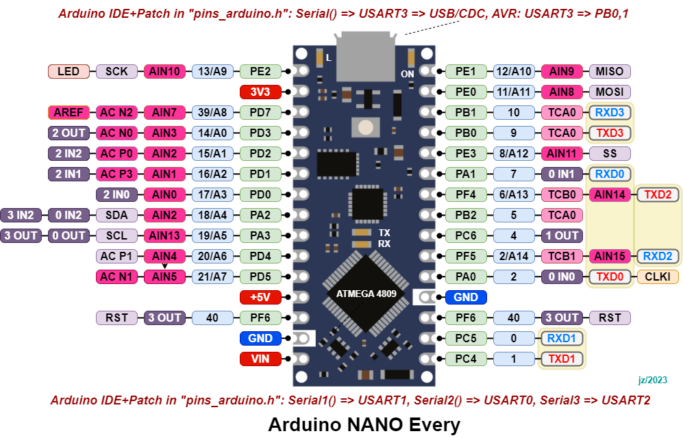

## SerialPassthrough  &nbsp; &nbsp;  
Testing Serial ports on the Arduino NANO Every module
- - - -

### Similar testing code for:
* [Arduino IDE](./Arduino/SerialPassthrough/) &nbsp; &nbsp; &nbsp; and/or 
* [PlatformIO IDE](./PlatformIO/SerialPassthrough/)

Each development environment uses two types of libraries;  
The use of Arduino libraries is focused on "Serial ports", and the use of AVR libraries is focused on "USART0,1,2,3 channels". 
Within each test, the test program can choose between cyclic transmitting or cross-communication between channels.

[Go to Doxygen Project Documentation](https://rcx-t.github.io/Serial_Passthrough/index.html)

Arduino support link:  https://github.com/arduino/ArduinoCore-megaavr

Arduino NANO Every board pinout:

[Go To TOP](#TOP)
